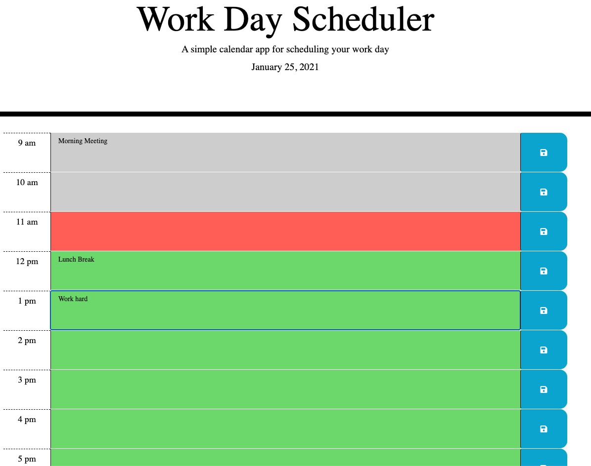

## Hello this is my work day calendar
* I made it using HTML, CSS and JavaScript.
* Timerows change the color to reflect current,past of future time.
* Used JavaScript localStorage to save the to do things.
* Here is the link to my one day calendar[Work day Calendar](https://jamirov.github.io/Work-day-calendar/")
*  This is the screen shot:

